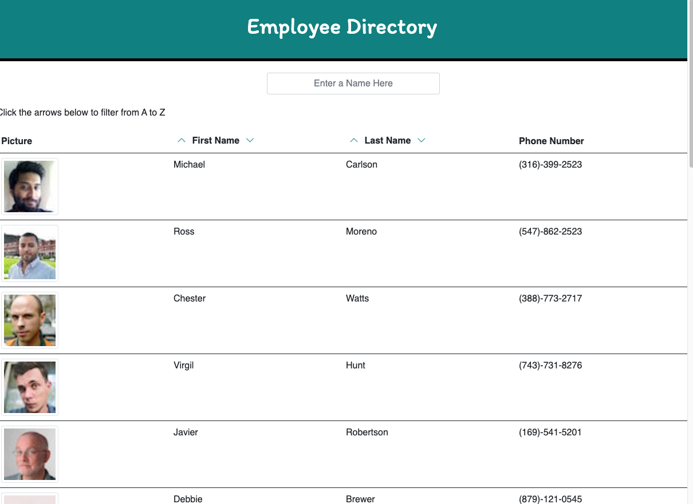

<h1 align="center">Employee Directory</h1>
<h4 align="center">David Bushard </h4> 
<h5 align="center">Homework 19 </h5>
 

## Table of Contents
- [Description](#description)
- [Installation](#installation)
- [Usage](#usage)
- [License](#license)
- [Contact Info ](#Contact-Info:)
 
 

## Description
An employee or manager would benefit greatly from being able to view non-sensitive data about other employees. It would be particularly helpful to be able to filter employees by name.

* I used ReactJs, Node JS, and Javascript
 
 

## User Story
As a user, I want to be able to view my entire employee directory at once so that I have quick access to their information.

 
 

## Installation
N/A
 
 

## Usage
N/A
 
 

## Links and Images
Repo - https://github.com/DavidBuoy/employee-directory
 
GitHubPages - https://davidbuoy.github.io/employee-directory/
 
 

 

 

 

 

 
 

 

 

## Contact Info:
David Bushard

Find me on GitHub:

 
Email me with any questions: Davidbushard@gmail.com
 
